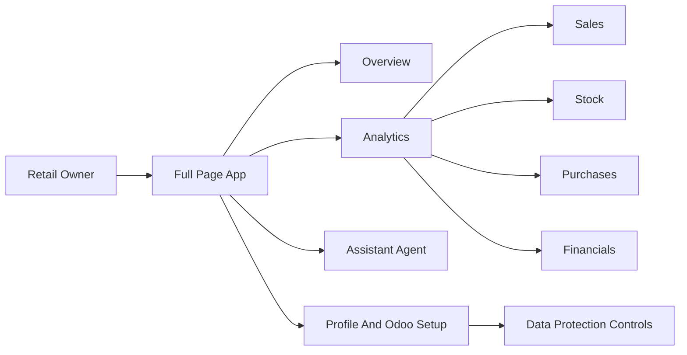

# Jhonny Retail Agent One-Sprint Backlog

**Status:** One-sprint execution plan
**Audience:** Tiago, Rodrigo, founding team, and pilot reviewers
**Scope:** App redesign, smarter agent, product readiness, performance, security, and client-facing quick wins
**Prepared:** May 12, 2026

---

## Executive Summary

The next version of the Jhonny Retail Agent should be delivered as one focused sprint. The goal is to turn the current POC into a sharper business-card product: a full-screen retail cockpit, a cleaner Analytics experience, a smarter assistant that understands Jhonny's business, and a safer onboarding story for future clients.

This sprint should not be positioned as a multi-release roadmap. It is a single improvement sprint that groups the most important UI, agent, performance, onboarding, and data protection work into one delivery plan. The expected effort is approximately **228-492 hours of owner-led Cursor / vibe-coding execution time**, depending on how far the team goes on secure credential storage, authentication, and deeper agent memory.

## Table of Contents

1. Sprint Goal
2. Feedback-To-Backlog Mapping
3. Target Product Direction
4. One-Sprint Priorities
   - 4.1 Priority 0: Full-Page Frame And Left Sidebar
   - 4.2 Priority 1: Rebuild Overview
   - 4.3 Priority 2: Modernize Analytics
   - 4.4 Priority 3: Assistant UI Polish
   - 4.5 Priority 3A: Smarter Cursor-Like Agent
   - 4.6 Priority 4: Profile And Odoo Settings
   - 4.7 Priority 5: Productization And Auth Path
   - 4.8 Priority 6: Efficiency, Speed, And Best Practices
   - 4.9 Priority 7: High-Impact Client Quick Wins
   - 4.10 Priority 8: Data Protection And Client Trust
5. Effort Estimate Summary In Cursor Hours
6. Sprint Execution Checklist
7. Validation Plan

## 1. Sprint Goal

Build a simpler, sharper, safer version of the app that can be shown to Jhonny and similar retailers as a credible paid-pilot product.

The sprint should deliver:

| Outcome | What Good Looks Like |
|---|---|
| Full-screen product feel | The app occupies the full page and uses a left sidebar. |
| Strong Overview | The first screen shows business health, KPIs, a modern chart, and owner priorities. |
| Cleaner Analytics | Users can inspect Sales, Stock, Purchases, and Financials without heavy scrolling. |
| Smarter Assistant | The agent behaves like a business copilot, not just a tool router. |
| Repeatable onboarding | Profile and Odoo settings make future clients easier to enable. |
| Better performance | The app feels faster and avoids unnecessary frontend/backend work. |
| Client trust | The product has clear data protection controls and a security narrative. |

## 2. Feedback-To-Backlog Mapping

Rodrigo's feedback points to a clear product shift: the app should stop feeling like a POC landing page and start feeling like a full-screen retail operating cockpit.

| Feedback Area | Sprint Response |
|---|---|
| App occupies only part of the page | Build a full-width shell with left-sidebar navigation. |
| Large Home hero does not make sense | Replace the surf/AI marketing hero with an Overview dashboard. |
| Need left bar tabs | Move navigation to `Overview`, `Analytics`, `Assistant Agent`, and `Profile`. |
| Analytics should avoid scrolling | Show one focused analytics section at a time with compact KPIs and one primary chart. |
| Charts should look more modern | Use cleaner line/area charts with minimal axes and date labels. |
| KPIs are too large | Reduce KPI card height, padding, and visual chrome. |
| Agent should not show tools/LLM | Hide technical metadata by default and show business-friendly evidence. |
| Need add chats | Add new chat and session switching. |
| Need profile/Odoo setup | Add Profile and Odoo setup, with tabs locked until connection is validated. |
| Avoid separate apps per user | Add tenant-aware settings, authentication direction, and secure credential handling. |
| Agent should act like Cursor | Improve the agent into a context-aware retail copilot with memory, reasoning, clarifying questions, and recommendations. |
| Need stronger data protection story | Add read-only access, secure credentials, tenant isolation, PII-safe logs, and a client-facing trust page. |

## 3. Target Product Direction

Position the next version as an owner cockpit, not an AI demo. The first screen should answer: how is the business doing today, what changed, and what needs attention?

Recommended product model:

## 4. One-Sprint Priorities

All priorities below belong to the same sprint. The priority numbers describe delivery order and importance, not separate releases.

| Priority | Area | Sprint Outcome | Estimated Effort |
|---:|---|---|---:|
| 0 | Full-page frame and left sidebar | Product feels like a modern SaaS cockpit. | 8-16 hours |
| 1 | Overview rebuild | First screen becomes a business command center. | 16-28 hours |
| 2 | Analytics modernization | Analytics becomes cleaner, smaller, and more useful. | 24-40 hours |
| 3 | Assistant UI polish | Agent looks client-safe and easier to use. | 12-24 hours |
| 3A | Smarter Cursor-like agent | Agent reasons across Jhonny's business and supports follow-ups. | 40-80 hours |
| 4 | Profile and Odoo settings | Future client onboarding becomes visible and repeatable. | 24-48 hours |
| 5 | Productization and auth path | App has a practical path beyond one-client demo mode. | 32-80 hours |
| 6 | Efficiency and best practices | App is faster and easier to maintain. | 24-56 hours |
| 7 | High-impact client quick wins | Product delivers visible business value quickly. | 24-48 hours |
| 8 | Data protection and client trust | App has a credible data-safe sales narrative. | 24-72 hours |

### 4.1 Priority 0: Full-Page Frame And Left Sidebar

Make the app occupy the full web page and feel like a modern SaaS cockpit.

| Feature | Estimate | Notes |
|---|---:|---|
| Full-width app shell | 2-4 hours | Replace centered layout with app-sized workspace. |
| Left sidebar navigation | 3-5 hours | Add `Overview`, `Analytics`, `Assistant Agent`, and `Profile`. |
| Active navigation state | 1-2 hours | Make the selected section obvious. |
| Top bar cleanup | 1-2 hours | Keep brand, connection state, theme, and user controls. |
| Footer reduction | 1 hour | Avoid wasting cockpit space. |
| Initial CSS cleanup | 2-4 hours | Remove obvious duplicate/legacy CSS conflicts. |

### 4.2 Priority 1: Rebuild Overview

Replace the oversized Home hero with a business overview.

| Feature | Estimate | Notes |
|---|---:|---|
| Rename Home to Overview | 1 hour | Aligns with cockpit language. |
| Remove large marketing hero | 2-4 hours | Drop the oversized “Where surfers become legends” box. |
| Compact KPI strip | 4-6 hours | Use daily sales, profit, YTD sales, stock value, payables, margin, and low-stock count. |
| Modern primary chart | 6-10 hours | Build a clean sales trend or business health chart. |
| Owner priorities card | 3-6 hours | Use existing briefing/recommendation data. |
| Data freshness and Odoo status | 2-4 hours | Build trust that data is live. |
| Remove fake trend labels | 1-2 hours | No unsupported movement labels. |
| Last-good data or demo resilience state | 3-6 hours | Avoid broken demos when Odoo is slow. |

### 4.3 Priority 2: Modernize Analytics

Analytics should feel like one focused dashboard view per section, not a long BI report.

| Feature | Estimate | Notes |
|---|---:|---|
| Split analytics into Sales, Stock, Purchases, Financials | 4-8 hours | One focused section at a time. |
| Day/week/month/quarter/year selector | 4-8 hours | Map current values first, then improve backend periods later. |
| Compact KPI card treatment | 3-5 hours | Reduce height and visual weight. |
| Modern chart treatment | 8-16 hours | Cleaner line/area charts, less chart noise. |
| Insight/action side panel | 4-8 hours | Translate chart into owner meaning. |
| Secondary breakdowns behind tabs/drawers | 6-10 hours | Preserve depth without long scrolling. |
| Stock/purchases/financial risk panels | 4-8 hours | Focus on owner decisions, not BI complexity. |

### 4.4 Priority 3: Assistant UI Polish

Make the agent feel like a product assistant, not an engineering debug panel.

| Feature | Estimate | Notes |
|---|---:|---|
| Hide `Tool`, `LLM`, raw args, and request IDs by default | 2-4 hours | Make answers client-safe. |
| Business-friendly evidence disclosure | 4-8 hours | Use labels like “Data checked” and “Evidence used”. |
| New chat button | 2-4 hours | Basic session reset and new conversation flow. |
| Chat session switching | 6-10 hours | Local session storage first. |
| Better assistant empty state | 2-4 hours | Outcome-focused starter prompts. |
| Portuguese-ready prompt examples | 2-4 hours | Useful for local clients. |
| Contextual “Ask about this” buttons | 4-8 hours | Link dashboard signals to agent questions. |

### 4.5 Priority 3A: Smarter Cursor-Like Agent

The agent should feel closer to Cursor for Jhonny's business: it should understand context, inspect the right data, explain its reasoning, ask follow-up questions, and suggest actions.

| Capability | Estimate | Notes |
|---|---:|---|
| Business context profile | 8-16 hours | Store company type, categories, suppliers, seasonality, owner priorities. |
| Conversation memory | 12-24 hours | Support follow-ups like “what about last month?” |
| Smarter multi-tool planning | 12-24 hours | Combine sales, stock, purchases, payables, and margin. |
| Clarifying questions | 6-12 hours | Ask when product/category/brand is missing. |
| Business diagnosis answers | 8-16 hours | Produce “how is the business doing?” briefings. |
| Confidence and caveats | 4-8 hours | Explain when margin/data quality is less reliable. |
| Generated action plans | 6-10 hours | Convert findings into steps. |
| Portuguese questions and answers | 6-12 hours | Detect/respond in selected language. |
| Agent evaluation tests | 8-16 hours | Test follow-ups, Portuguese, ambiguity, and hallucination control. |

### 4.6 Priority 4: Profile And Odoo Settings

This is the key step toward reusable pilots instead of one app per customer.

| Feature | Estimate | Notes |
|---|---:|---|
| Add Profile section to sidebar | 2-4 hours | Gives settings a clear product home. |
| Company profile form | 4-8 hours | Store name, vertical, language, currency, timezone. |
| Odoo credentials form | 6-12 hours | URL, DB, username, API key. |
| Odoo connection validation endpoint | 8-16 hours | Test credentials and show connection status. |
| Locked tabs until connection is validated | 4-8 hours | Clear onboarding flow. |
| Client readiness checklist | 2-4 hours | Shows what clients need to provide. |
| Last successful Odoo read status | 2-4 hours | Builds confidence in live data. |

### 4.7 Priority 5: Productization And Auth Path

Move from a single-client POC toward a repeatable paid-pilot product.

| Feature | Estimate | Notes |
|---|---:|---|
| Replace demo token direction with auth design | 4-8 hours | Design and initial implementation path. |
| Basic signed sessions | 12-24 hours | Needed before external clients. |
| Tenant/company configuration model | 12-24 hours | Each client needs separate settings. |
| Parameterize hard-coded Jhonny identity | 6-12 hours | Store name, vertical, currency, language. |
| Restrict direct `/tools/{tool_name}` access | 4-8 hours | Avoid broad tool access in production. |
| Production webhook signature enforcement | 4-8 hours | WhatsApp must be secure in hosted pilots. |
| Durable rate-limit direction | 4-8 hours | Needed for multi-instance deployment. |
| Decide/deprecate legacy `src/web_app.py` | 2-4 hours | Avoid route confusion. |

### 4.8 Priority 6: Efficiency, Speed, And Best Practices

Make the app faster, easier to maintain, and safer to extend.

| Feature | Estimate | Notes |
|---|---:|---|
| Split large `frontend/app/page.tsx` | 16-32 hours | Break into Overview, Analytics, Assistant, Profile, hooks, and charts. |
| Lazy-render analytics sections | 6-12 hours | Avoid rendering every heavy chart. |
| Memoize derived chart/KPI data | 4-8 hours | Reduce unnecessary recalculation. |
| Simplify Recharts usage | 6-12 hours | Fewer chart types, shared wrapper. |
| Clean `frontend/app/globals.css` | 4-8 hours | Remove duplicate layers and legacy rules. |
| Improve loading/error states | 6-12 hours | Show stale data and clear refresh states. |
| Add request timeout handling | 3-6 hours | Better behavior when backend/Odoo is slow. |
| Dashboard caching | 8-16 hours | Short server-side cache for demo and speed. |
| Bounded Odoo reads and timing logs | 8-16 hours | Improve backend reliability. |
| Build/lint/smoke validation | 3-6 hours | Confirm stability before demo. |

### 4.9 Priority 7: High-Impact Client Quick Wins

Add features that are easy to explain and valuable to retail clients.

| Feature | Estimate | Notes |
|---|---:|---|
| Daily owner briefing card | 4-8 hours | Highest immediate client value. |
| Low-stock action list | 4-8 hours | Prevent lost sales. |
| Overstock/dead-stock view | 6-12 hours | Shows money trapped in inventory. |
| Supplier bills attention panel | 4-8 hours | Highlights cash exposure. |
| Purchase vs sales warning | 4-8 hours | Warns when buying is ahead of sales. |
| Margin reliability score | 6-10 hours | Shows whether margin can be trusted. |
| Data quality health check | 8-16 hours | Missing costs, zero prices, below-cost products. |
| Export/share summary | 4-8 hours | Copy daily/weekly summary to WhatsApp/email. |
| Language toggle for key labels | 4-8 hours | Portuguese/English UI basics. |
| Weekly insights screen | 8-16 hours | Recurring review artifact. |

### 4.10 Priority 8: Data Protection And Client Trust

The product must be sellable not only as a smart retail cockpit, but as a safe way to use sensitive retail data.

| Control | Estimate | Notes |
|---|---:|---|
| Client trust page | 2-4 hours | “How we protect your data” onboarding section. |
| Security checklist | 2-4 hours | Pre-pilot secrets, CORS, auth, logging, Odoo permissions. |
| Read-only and least-privilege Odoo guidance | 2-4 hours | Strong client-safe sales message. |
| Remove credentials from frontend flows | 4-8 hours | Do not store API keys in browser local storage. |
| Encrypted server-side credential storage | 16-40 hours | Required for serious hosted pilots. |
| Tenant data isolation | 16-32 hours | Separate credentials, cache, settings, and access. |
| PII-safe logging | 6-12 hours | Avoid secrets and personal data in logs. |
| Retention policy | 4-8 hours | Define chat/log/cache retention. |
| Webhook hardening | 4-8 hours | Require signatures and durable rate limits. |
| Role-based access direction | 8-16 hours | Owner/admin/viewer foundation. |

Client-facing trust narrative:

| Message | Meaning |
|---|---|
| Read-only by default | The app helps owners decide; it does not change Odoo records in the first pilot. |
| Credentials stay server-side | API keys are not exposed in the browser. |
| Only needed data is used | The agent receives curated business summaries, not unrestricted database access. |
| Company data is isolated | Each tenant has separate credentials, cache, settings, and access controls. |
| Personal data is avoided | The assistant focuses on sales, stock, purchases, bills, and margin, not customer PII. |
| Every answer can show evidence | Users can inspect business-friendly evidence behind recommendations. |

## 5. Effort Estimate Summary In Cursor Hours

The sprint is broad. The estimate below is not a traditional agency delivery estimate. It is intended as the hands-on time for **you working with Cursor / vibe-coding** to perform the tasks, including implementation, iteration, and basic local validation. It assumes no long external design approval cycle.

| Area | Low Estimate | High Estimate | Notes |
|---|---:|---:|---|
| Priority 0: Full-page frame | 8 hours | 16 hours | Shell, sidebar, active state, first CSS cleanup. |
| Priority 1: Overview | 16 hours | 28 hours | KPI strip, chart, priorities, no fake trends. |
| Priority 2: Analytics | 24 hours | 40 hours | Cleaner sections, charts, period selector, risk panels. |
| Priority 3: Assistant UI | 12 hours | 24 hours | Metadata hiding, evidence, new chats, prompts. |
| Priority 3A: Smart agent | 40 hours | 80 hours | Memory, multi-tool reasoning, Portuguese, evaluations. |
| Priority 4: Profile/Odoo settings | 24 hours | 48 hours | Settings UI, validation, locked tabs. |
| Priority 5: Productization/auth path | 32 hours | 80 hours | Auth, tenant model, production route hardening. |
| Priority 6: Performance/best practices | 24 hours | 56 hours | Component split, caching, bounded reads, validation. |
| Priority 7: Client quick wins | 24 hours | 48 hours | Briefing, action lists, data quality, summary. |
| Priority 8: Data protection | 24 hours | 72 hours | Trust page, encrypted secrets, tenant isolation, PII-safe logs. |
| Total | 228 hours | 492 hours | Scope can be reduced by deferring deep auth/secrets/tenant work. |

Recommended sprint cut if time is limited:

| Keep In Sprint | Defer If Needed |
|---|---|
| Full-page shell and sidebar | Full role-based access |
| Overview redesign | Deep industry template system |
| Cleaner Sales analytics | Full analytics redesign for every secondary chart |
| Assistant metadata hiding and evidence | Persistent backend chat history |
| Daily briefing and action list | Advanced weekly insight automation |
| Basic Profile/Odoo setup screen | Fully encrypted multi-tenant secret vault |
| Data trust page and security checklist | Complete production compliance pack |

## 6. Sprint Execution Checklist

| Step | Work |
|---:|---|
| 1 | Build the full-page app frame and left sidebar. |
| 2 | Rebuild Overview as the business command center. |
| 3 | Simplify Analytics into focused sections with modern charts. |
| 4 | Polish the Assistant UI and hide implementation details. |
| 5 | Add smarter agent behavior and evaluation coverage. |
| 6 | Add Profile/Odoo setup and connection validation. |
| 7 | Add high-impact client quick wins: briefing, action list, data quality, payables, stock risk. |
| 8 | Improve performance: component split, lazy rendering, caching, bounded Odoo reads. |
| 9 | Add data protection controls and trust narrative. |
| 10 | Validate build, smoke tests, agent quality, and PDF/demo materials. |

## 7. Validation Plan

| Validation Area | Check |
|---|---|
| Visual demo | App uses full page, left sidebar, and no oversized marketing hero. |
| Overview | User can understand business status in under 30 seconds. |
| Analytics | Primary views avoid awkward scrolling on a laptop viewport. |
| Chart quality | Overview and Sales charts feel modern and clean. |
| Dashboard contract | `/dashboard` still powers visible KPIs after the UI reshuffle. |
| Assistant evidence | `/chat` still returns evidence, while UI exposes only business-friendly evidence by default. |
| Agent intelligence | Test realistic Jhonny questions, Portuguese questions, ambiguous questions, follow-ups, and cross-domain diagnosis questions. |
| Hallucination control | Assistant does not invent trends, comparisons, margins, or stock risk when tool data is missing. |
| Performance | Profile dashboard load, analytics tab switch, and first assistant answer. |
| Security | Verify no Odoo credentials are stored in browser local storage, logs do not contain secrets, production webhooks require signatures, and tenant-scoped data cannot cross users. |
| Regression | Run frontend build and backend smoke checks before demo review. |

