# Jhonny Surf Store — Website Launch Status

**Audience:** owner + shop/ops + technical team  
**Last updated:** 23 July 2026  
**Live sites:** [jhonnysurfstore.com](https://www.jhonnysurfstore.com) · [jhonnysurfstore.pt](https://www.jhonnysurfstore.pt)  
**HTML version:** [website-launch-status.html](./website-launch-status.html)  
**PDF version:** [website-launch-status.pdf](./website-launch-status.pdf)

---

## 1. Purpose

This document states whether the website is ready for **public online purchases**, what already works, and the **ordered backlog** to go live on both domains with full payment support — including **brand imagery** and **security hardening** against abuse and external attacks.

---

## 2. Executive verdict

**Not ready for public purchases yet.**

The marketing site, product catalog, and shopping foundations are largely in place. What still blocks selling online is **real payment processing**, **post-checkout payment instructions**, **stock/coupon correctness**, **order emails**, **opening the .pt domain**, and **security controls** so payment callbacks and store APIs cannot be abused.

| Area | Status |
|------|--------|
| Brand / homepage content | Ready (imagery refresh still needed — see P1.8) |
| Product catalog (Odoo → site) | Connected, but **not guaranteed near real-time** (see P0.18) |
| Browse shop, filters, product pages | Ready for browsing |
| Cart + guest/account checkout skeleton | Built, not production-safe |
| Payments (MB WAY, Multibanco, PayPal, Klarna) | **Not ready** |
| Security / abuse protection | **Partial — harden before open checkout** |
| Order email + ops admin | **Not ready** |
| Public go-live (.com + .pt) | **Blocked** |

---

## 3. What works today

- Homepage and store story (New In, categories, services, Local Heroes, visit/contact).
- Shop at `/loja` with catalog from Odoo/Postgres; product detail pages and ratings.
- Guest and registered carts; add-to-cart with stock checks at add/checkout time.
- Account register / login / session.
- Coupon validation plumbing (including welcome / athlete codes when seeded in DB).
- Pickup vs ship-to-address pricing logic on the server.
- Legal pages in Portuguese and English.
- **.com** is publicly browsable (home, shop, checkout pages load).
- **Odoo** is connected in production (catalog sync / auth OK as of last scan).
- Baseline app security: httpOnly session cookies, bcrypt passwords, Zod validation on APIs, Prisma (no raw SQL), React-escaped UI (no `dangerouslySetInnerHTML`).

---

## 4. Target launch decisions

These are the agreed end-state for go-live:

| Decision | Choice |
|----------|--------|
| Domains | Open **.com and .pt together** (remove .pt coming-soon gate) |
| Day-1 payments | **MB WAY + Multibanco + PayPal + Klarna** |
| Free shipping | **€100** everywhere (banner, checkout, legal) |
| Languages at launch | Site already supports PT / EN / ZH for most UX; legal ZH can follow later |
| Brand imagery | Homepage + category heroes use **recent real store / product photos** (not stale assets) |
| Odoo ↔ website | Catalog (products, price, stock, categories, New In / offers) stays in **near real-time** sync |
| Security bar | Fail closed on payments/secrets; authenticated admin/sync APIs; rate limits; security headers |

---

## 5. Current gaps (snapshot)

From production integration status and code review:

| Integration | Production status |
|-------------|-------------------|
| Odoo | Configured and authenticated — catalog sync exists but is **not a reliable near-real-time pipeline** yet |
| Email (Resend) | **Not configured** — order emails skipped |
| Ifthenpay MB WAY | **Not configured** — would fall back to mocks |
| Ifthenpay Multibanco | **Not configured** — would fall back to mocks |
| Ifthenpay callback secret | **Not configured** |
| PayPal | Placeholder only |
| Klarna | Placeholder only |

Other important mismatches / risks:

- Banner already says free shipping over **€100**; checkout + legal still use **€50**.
- After checkout, customers do **not** see Multibanco entity/reference or MB WAY next steps.
- Stock is checked but **not reserved/decremented** → oversell risk.
- Coupons can be consumed when the order is created, even if payment never completes.
- Ship-to-address fields are not strictly required in the UI.
- Until `SITE_PUBLIC_LAUNCH=true`, **both .com and .pt** show coming-soon to the public; staff unlock via `/preview-access` + `SITE_PREVIEW_PASSWORD`.
- If catalog/DB fails, mock demo products must not become sellable.
- No simple admin screen to process orders; no customer “My orders” history.
- Homepage hero / category tile images may be outdated vs recent store photography.
- Odoo → website catalog updates are **not guaranteed near real-time**: with `ODOO_LIVE_CATALOG=true`, listing may kick a **background** sync only when DB data is older than **~15 minutes** and someone hits the shop; there is no scheduled cron and no Odoo product-change webhook. Manual `POST /api/odoo/sync/products` still exists.
- Security gaps listed in §5.1 below.

### 5.1 Security posture (attack resistance)

**Already in good shape**

- Session JWT in httpOnly + `SameSite=lax` cookie; role re-checked from DB (not trusted from token alone).
- Passwords hashed with bcrypt; Zod schemas on auth/cart/checkout routes.
- Guest cart/rating tokens stored as hashes.
- Admin order-status API requires `ADMIN` role.
- Prisma ORM only (no raw SQL string building).
- No HTML injection via `dangerouslySetInnerHTML` in the storefront UI.

**Must fix before open checkout (P0)**

| Risk | Why it matters |
|------|----------------|
| Ifthenpay callback secret optional + no amount/status check | Attacker who knows an order reference can mark orders **paid** |
| Missing payment keys → mock / placeholder “payments” | Fake paid state in production |
| Mock catalog upserted into DB if catalog empty | Demo SKUs become sellable |
| `POST /api/odoo/sync/products` unauthenticated | Anyone can trigger sync / DoS Odoo |
| No rate limits on login, register, checkout, callback | Brute-force and abuse |
| Soft-default `SESSION_SECRET` if unset | Predictable sessions if misconfigured |
| No security HTTP headers (CSP, HSTS, frame deny, etc.) | Clickjacking / XSS blast-radius / downgrade |

**Should fix soon after / with launch ops (P1)**

| Risk | Why it matters |
|------|----------------|
| No password reset / email verification | Account recovery and takeover resistance |
| Public integrations/Odoo status APIs | Leaks config readiness to scanners |
| Order email HTML unsanitized fields | HTML injection into customer inbox |
| Ratings / availability without rate limits | Spam / abuse |

---

## 6. Priority backlog

Effort below is **rough technical sizing** for planning (not a calendar commitment).  
S ≈ hours · M ≈ 1–2 days · L ≈ several days.

### P0 — Must ship before public purchases

| # | Item | Why it matters | Effort |
|---|------|----------------|--------|
| P0.1 | Configure **Ifthenpay** (MB WAY + Multibanco keys + callback URL + secret) and **fail closed** in production (no mock refs) | Without this, “paid” orders are fake | S–M (config + code guard) |
| P0.2 | Implement and connect **PayPal** for real capture/redirect | Required for day-1 payment set | L |
| P0.3 | Implement and connect **Klarna** for real checkout | Required for day-1 payment set | L |
| P0.4 | Harden payment **callback** (secret **always** required in prod, constant-time compare, **amount + status** checks) | Prevents forged “paid” states | S–M |
| P0.5 | Post-checkout UX + email: show Multibanco entity/ref, MB WAY status, PayPal/Klarna next steps | Customer must know how to pay | M |
| P0.6 | Configure **transactional email** (Resend or SMTP) and send order + payment instructions | No email = broken ops and trust | S (config) + S–M (content) |
| P0.7 | **Reserve/decrement stock** on order (release on cancel/expiry) | Stops overselling | M |
| P0.8 | Apply **coupon usage only after payment** (or roll back if unpaid) | Stops burned coupons | S–M |
| P0.9 | Require full **shipping address** when ship-to-home is selected | Avoid undeliverable orders | S |
| P0.10 | Align **€100 free shipping** in checkout logic + legal pages | Matches banner and launch decision | S |
| P0.11 | Show **shipping cost in checkout total** UI | Total currently can understate amount due | S |
| P0.12 | Open public domains: set **`SITE_PUBLIC_LAUNCH=true`** (removes coming-soon on .com + .pt) when checkout is ready | Needed for joint .com/.pt launch; until then public sees coming-soon and staff use `/preview-access` | S |
| P0.13 | Block **mock catalog** from selling in production | Avoid selling demo products | S |
| P0.14 | Confirm production secrets (session, DB, Odoo, payments, email) on Vercel; **refuse to boot/checkout** if `SESSION_SECRET` is missing or still the default | Security and reliability | S |
| P0.15 | **Rate-limit** login, register, checkout, coupon, and payment-callback endpoints | Stops brute-force and callback flooding | S–M |
| P0.16 | **Lock down** Odoo product sync and integrations/status APIs (admin session or shared secret; no anonymous write/probe) | Stops unauthorized sync / info leak | S |
| P0.17 | Add **security HTTP headers** (HSTS, `X-Frame-Options`/`frame-ancestors`, `Referrer-Policy`, baseline CSP, `nosniff`) | Hardens browser attack surface | S |
| P0.18 | **Near real-time Odoo ↔ website catalog sync**: scheduled sync (e.g. every 5–15 min via Vercel cron), optional Odoo webhook/push on product/stock/price change, sync health check (last success time + alert), and verify live stock/price/categories/New In/offers match Odoo within the SLA | Stale catalog sells wrong price/stock; new products and Odoo edits must show on the site quickly | M |

**P0 rough total:** about **2–4 weeks** of focused build + provider setup, dominated by PayPal + Klarna (P0.2–P0.3) if both must ship on day 1. Security items P0.4 / P0.14–P0.17 and catalog freshness **P0.18** are mostly S–M and should be done **before** opening paid traffic.

### P1 — Launch ops and trust

| # | Item | Why it matters | Effort |
|---|------|----------------|--------|
| P1.1 | Minimal **admin orders** view (list, status, pickup/ship) | Staff cannot run the store blind | M–L |
| P1.2 | Customer **My orders** in account | Expected after purchase | M |
| P1.3 | Password reset / email verification | Account safety for public traffic | M |
| P1.4 | Enforce **JHONNY10** rules (registered + first purchase) | Matches welcome offer promise | S–M |
| P1.5 | Update **FAQ** / trust copy that still implies the store is “not ready” | Avoid conflicting messages at launch | S |
| P1.6 | Smoke-test suite or scripted checklist for cart → pay → callback → paid | Catch regressions before opening traffic | M |
| P1.7 | End-to-end test orders on each payment method (sandbox then live) | Go-live gate | M (ops time) |
| P1.8 | Refresh **homepage + category hero images** with recent store / product photos (assets under `website/public/brand/` and mappings in `Products.tsx` / `categoryHeroes.ts`) | Brand looks current and trustworthy at launch | S–M (assets + wire-up) |
| P1.9 | Escape/sanitize fields in **order email HTML**; tighten public ratings/availability against spam | Stops inbox HTML injection and abuse | S–M |

### P2 — Soon after go-live

| # | Item | Effort |
|---|------|--------|
| P2.1 | Localize shop / PDP / checkout strings still hardcoded in Portuguese | M |
| P2.2 | Real cart drawer (lines, qty, remove) instead of count-only header cart | M |
| P2.3 | Hide empty Odoo categories (e.g. women wetsuits with 0 products) or fill in Odoo | S–M |
| P2.4 | Product image gallery (beyond single thumbnail) | M |
| P2.5 | Clear rules for bulky board shipping vs standard € shipping | S–M (policy + code) |
| P2.6 | Variant UX if size/color are separate Odoo products | M–L |

### P3 — Later / growth

| # | Item | Effort |
|---|------|--------|
| P3.1 | Chinese (ZH) legal pages | M |
| P3.2 | SEO: sitemap, robots, product OG/JSON-LD | S–M |
| P3.3 | Analytics (consent flag exists; wire GA/GTM or equivalent) | S–M |
| P3.4 | Ratings on product cards (already on PDP) | S |
| P3.5 | Abandoned-cart emails | M |

---

## 7. Suggested go-live sequence

1. **Configure production:** Ifthenpay, email, Odoo, secrets — fail closed if payments/email/session secret missing.  
2. **Security baseline:** callback hardening, rate limits, lock sync/status APIs, security headers (P0.4, P0.14–P0.17).  
3. **Odoo freshness:** scheduled + (optional) webhook catalog sync with health monitoring (P0.18).  
4. **Ship PT payment path:** MB WAY + Multibanco end-to-end (UI + email + callback).  
5. **Ship international payments:** PayPal, then Klarna (or in parallel if two people).  
6. **Harden commerce rules:** stock reservation, coupons-after-pay, address required, €100 shipping everywhere, honest checkout totals.  
7. **Ops + brand:** admin order list, FAQ/trust copy, **recent homepage/category photos** (P1.8).  
8. **Open domains:** set `SITE_PUBLIC_LAUNCH=true` on Vercel (removes coming-soon on .com + .pt).  
9. **Gate:** complete one successful live (or final sandbox) order per payment method; then announce.

```mermaid
flowchart LR
  config[Config_secrets_providers]
  security[Security_baseline]
  odooSync[Odoo_near_realtime_sync]
  ptPay[MBWAY_Multibanco]
  intlPay[PayPal_Klarna]
  rules[Stock_coupons_shipping]
  ops[Admin_emails_brand_images]
  domains[Open_com_and_pt]
  config --> security --> odooSync --> ptPay --> intlPay --> rules --> ops --> domains
```

---

## 8. Definition of “live for purchases”

All of the following must be true:

- [ ] Customers can pay with **MB WAY, Multibanco, PayPal, and Klarna** for real (no mocks/placeholders).  
- [ ] After checkout they receive clear **payment instructions** (page + email).  
- [ ] Paid orders update correctly via **secure callback** (secret required; amount/status verified).  
- [ ] Stock cannot oversell; coupons only stick on paid orders.  
- [ ] Free shipping threshold is **€100** in banner, checkout, and legal text.  
- [ ] Order emails send reliably.  
- [ ] Staff can see and update orders.  
- [ ] **jhonnysurfstore.com** and **jhonnysurfstore.pt** both serve the full shop (`SITE_PUBLIC_LAUNCH=true`).  
- [ ] Auth/checkout/callback are **rate-limited**; Odoo sync is **not** anonymously callable.  
- [ ] Production refuses weak/default **SESSION_SECRET**; security headers are on.  
- [ ] Odoo catalog changes (products, price, stock, categories, offers) appear on the website in **near real time** (scheduled sync and/or webhook; sync health OK).  
- [ ] Homepage + category heroes use **approved recent photos**.  

Until that checklist is green, treat the site as **marketing + catalog preview**, not an open webshop.

---

## 9. Key technical references

| Topic | Location |
|-------|----------|
| Coming-soon + preview unlock | `website/src/proxy.ts`, `website/src/lib/ecommerce/siteAccess.ts`, `/preview-access` |
| Checkout / shipping threshold | `website/src/lib/ecommerce/checkout.ts` |
| Payments / mocks / placeholders | `website/src/lib/ecommerce/payments.ts` |
| Ifthenpay callback | `website/src/app/api/payments/ifthenpay/callback/route.ts` |
| Session / cookies | `website/src/lib/ecommerce/session.ts` |
| Auth validation | `website/src/lib/ecommerce/security.ts`, `schemas.ts` |
| Odoo product sync API | `website/src/app/api/odoo/sync/products/route.ts` |
| Catalog list + background stale sync (~15 min) | `website/src/lib/ecommerce/catalog.ts` (`kickBackgroundOdooSync`) |
| Odoo fetch / upsert sync | `website/src/lib/ecommerce/odooCatalog.ts` (`syncOdooProducts`) |
| Category hero images | `website/src/lib/ecommerce/categoryHeroes.ts`, `website/src/components/Products.tsx` |
| Homepage hero media | `website/src/components/Hero.tsx`, `website/public/brand/` |
| Checkout UI | `website/src/components/CheckoutClient.tsx` |
| Dispatch free-shipping copy | `website/src/components/DispatchBanner.tsx` |
| Integrations status API | `/api/integrations/status` |
| Legal shipping copy | `website/src/app/pagamentos-e-envios/page.tsx` |
| Vercel auto-deploy | `docs/website-vercel-deploy.md`, `.github/workflows/deploy-website.yml` |

---

*This document is the working backlog for launch. Update status checkboxes and dates as P0 items close.*
