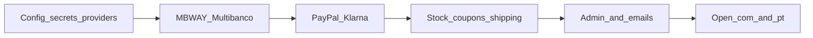

# Jhonny Surf Store — Website Launch Status

**Audience:** owner + shop/ops + technical team  
**Last updated:** 19 July 2026  
**Live sites:** [jhonnysurfstore.com](https://www.jhonnysurfstore.com) · [jhonnysurfstore.pt](https://www.jhonnysurfstore.pt)  
**HTML version:** [website-launch-status.html](./website-launch-status.html)  
**PDF version:** [website-launch-status.pdf](./website-launch-status.pdf)

---

## 1. Purpose

This document states whether the website is ready for **public online purchases**, what already works, and the **ordered backlog** to go live on both domains with full payment support.

---

## 2. Executive verdict

**Not ready for public purchases yet.**

The marketing site, product catalog, and shopping foundations are largely in place. What still blocks selling online is **real payment processing**, **post-checkout payment instructions**, **stock/coupon correctness**, **order emails**, and **opening the .pt domain**.

| Area | Status |
|------|--------|
| Brand / homepage content | Ready |
| Product catalog (Odoo → site) | Ready (synced) |
| Browse shop, filters, product pages | Ready for browsing |
| Cart + guest/account checkout skeleton | Built, not production-safe |
| Payments (MB WAY, Multibanco, PayPal, Klarna) | **Not ready** |
| Order email + ops admin | **Not ready** |
| Public go-live (.com + .pt) | **Blocked** |

---

## 3. What works today

- Homepage and store story (New In, categories, services, Local Heroes, visit/contact).
- Shop at `/loja` with catalog from Odoo/Postgres; product detail pages and ratings.
- Guest and registered carts; add-to-cart with stock checks at add/checkout time.
- Account register / login / session.
- Coupon validation plumbing (including welcome / athlete codes when seeded in DB).
- Pickup vs ship-to-address pricing logic on the server.
- Legal pages in Portuguese and English.
- **.com** is publicly browsable (home, shop, checkout pages load).
- **Odoo** is connected in production (catalog sync / auth OK as of last scan).

---

## 4. Target launch decisions

These are the agreed end-state for go-live:

| Decision | Choice |
|----------|--------|
| Domains | Open **.com and .pt together** (remove .pt coming-soon gate) |
| Day-1 payments | **MB WAY + Multibanco + PayPal + Klarna** |
| Free shipping | **€100** everywhere (banner, checkout, legal) |
| Languages at launch | Site already supports PT / EN / ZH for most UX; legal ZH can follow later |

---

## 5. Current gaps (snapshot)

From production integration status and code review:

| Integration | Production status |
|-------------|-------------------|
| Odoo | Configured and authenticated |
| Email (Resend) | **Not configured** — order emails skipped |
| Ifthenpay MB WAY | **Not configured** — would fall back to mocks |
| Ifthenpay Multibanco | **Not configured** — would fall back to mocks |
| Ifthenpay callback secret | **Not configured** |
| PayPal | Placeholder only |
| Klarna | Placeholder only |

Other important mismatches / risks:

- Banner already says free shipping over **€100**; checkout + legal still use **€50**.
- After checkout, customers do **not** see Multibanco entity/reference or MB WAY next steps.
- Stock is checked but **not reserved/decremented** → oversell risk.
- Coupons can be consumed when the order is created, even if payment never completes.
- Ship-to-address fields are not strictly required in the UI.
- `.pt` still rewrites to the coming-soon page.
- If catalog/DB fails, mock demo products must not become sellable.
- No simple admin screen to process orders; no customer “My orders” history.

---

## 6. Priority backlog

Effort below is **rough technical sizing** for planning (not a calendar commitment).  
S ≈ hours · M ≈ 1–2 days · L ≈ several days.

### P0 — Must ship before public purchases

| # | Item | Why it matters | Effort |
|---|------|----------------|--------|
| P0.1 | Configure **Ifthenpay** (MB WAY + Multibanco keys + callback URL + secret) and **fail closed** in production (no mock refs) | Without this, “paid” orders are fake | S–M (config + code guard) |
| P0.2 | Implement and connect **PayPal** for real capture/redirect | Required for day-1 payment set | L |
| P0.3 | Implement and connect **Klarna** for real checkout | Required for day-1 payment set | L |
| P0.4 | Harden payment **callback** (secret required, amount/status checks) | Prevents false “paid” states | S–M |
| P0.5 | Post-checkout UX + email: show Multibanco entity/ref, MB WAY status, PayPal/Klarna next steps | Customer must know how to pay | M |
| P0.6 | Configure **transactional email** (Resend or SMTP) and send order + payment instructions | No email = broken ops and trust | S (config) + S–M (content) |
| P0.7 | **Reserve/decrement stock** on order (release on cancel/expiry) | Stops overselling | M |
| P0.8 | Apply **coupon usage only after payment** (or roll back if unpaid) | Stops burned coupons | S–M |
| P0.9 | Require full **shipping address** when ship-to-home is selected | Avoid undeliverable orders | S |
| P0.10 | Align **€100 free shipping** in checkout logic + legal pages | Matches banner and launch decision | S |
| P0.11 | Show **shipping cost in checkout total** UI | Total currently can understate amount due | S |
| P0.12 | Remove **.pt coming-soon** gate when ready to open both domains | Needed for joint .com/.pt launch | S |
| P0.13 | Block **mock catalog** from selling in production | Avoid selling demo products | S |
| P0.14 | Confirm production secrets (session, DB, Odoo, payments, email) on Vercel | Security and reliability | S |

**P0 rough total:** about **2–4 weeks** of focused build + provider setup, dominated by PayPal + Klarna (P0.2–P0.3) if both must ship on day 1.

### P1 — Launch ops and trust

| # | Item | Why it matters | Effort |
|---|------|----------------|--------|
| P1.1 | Minimal **admin orders** view (list, status, pickup/ship) | Staff cannot run the store blind | M–L |
| P1.2 | Customer **My orders** in account | Expected after purchase | M |
| P1.3 | Password reset / email verification | Account safety for public traffic | M |
| P1.4 | Enforce **JHONNY10** rules (registered + first purchase) | Matches welcome offer promise | S–M |
| P1.5 | Update **FAQ** / trust copy that still implies the store is “not ready” | Avoid conflicting messages at launch | S |
| P1.6 | Smoke-test suite or scripted checklist for cart → pay → callback → paid | Catch regressions before opening traffic | M |
| P1.7 | End-to-end test orders on each payment method (sandbox then live) | Go-live gate | M (ops time) |

### P2 — Soon after go-live

| # | Item | Effort |
|---|------|--------|
| P2.1 | Localize shop / PDP / checkout strings still hardcoded in Portuguese | M |
| P2.2 | Real cart drawer (lines, qty, remove) instead of count-only header cart | M |
| P2.3 | Hide empty Odoo categories (e.g. women wetsuits with 0 products) or fill in Odoo | S–M |
| P2.4 | Product image gallery (beyond single thumbnail) | M |
| P2.5 | Clear rules for bulky board shipping vs standard € shipping | S–M (policy + code) |
| P2.6 | Variant UX if size/color are separate Odoo products | M–L |

### P3 — Later / growth

| # | Item | Effort |
|---|------|--------|
| P3.1 | Chinese (ZH) legal pages | M |
| P3.2 | SEO: sitemap, robots, product OG/JSON-LD | S–M |
| P3.3 | Analytics (consent flag exists; wire GA/GTM or equivalent) | S–M |
| P3.4 | Ratings on product cards (already on PDP) | S |
| P3.5 | Abandoned-cart emails | M |

---

## 7. Suggested go-live sequence

1. **Configure production:** Ifthenpay, email, Odoo, secrets — fail closed if payments/email missing.  
2. **Ship PT payment path:** MB WAY + Multibanco end-to-end (UI + email + callback).  
3. **Ship international payments:** PayPal, then Klarna (or in parallel if two people).  
4. **Harden commerce rules:** stock reservation, coupons-after-pay, address required, €100 shipping everywhere, honest checkout totals.  
5. **Ops minimum:** admin order list + FAQ/trust copy update.  
6. **Open domains:** remove `.pt` coming-soon; keep `.com` live.  
7. **Gate:** complete one successful live (or final sandbox) order per payment method; then announce.

---

## 8. Definition of “live for purchases”

All of the following must be true:

- [ ] Customers can pay with **MB WAY, Multibanco, PayPal, and Klarna** for real (no mocks/placeholders).  
- [ ] After checkout they receive clear **payment instructions** (page + email).  
- [ ] Paid orders update correctly via **secure callback**.  
- [ ] Stock cannot oversell; coupons only stick on paid orders.  
- [ ] Free shipping threshold is **€100** in banner, checkout, and legal text.  
- [ ] Order emails send reliably.  
- [ ] Staff can see and update orders.  
- [ ] **jhonnysurfstore.com** and **jhonnysurfstore.pt** both serve the full shop (no coming-soon gate).  

Until that checklist is green, treat the site as **marketing + catalog preview**, not an open webshop.

---

## 9. Key technical references

| Topic | Location |
|-------|----------|
| .pt coming-soon gate | `website/src/proxy.ts` |
| Checkout / shipping threshold | `website/src/lib/ecommerce/checkout.ts` |
| Payments / mocks / placeholders | `website/src/lib/ecommerce/payments.ts` |
| Checkout UI | `website/src/components/CheckoutClient.tsx` |
| Dispatch free-shipping copy | `website/src/components/DispatchBanner.tsx` |
| Integrations status API | `/api/integrations/status` |
| Legal shipping copy | `website/src/app/pagamentos-e-envios/page.tsx` |

---

*This document is the working backlog for launch. Update status checkboxes and dates as P0 items close.*
