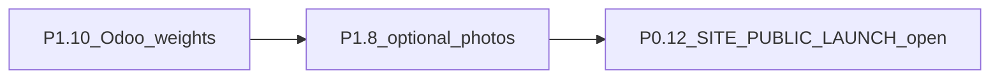

# Jhonny Surf Store — Website Launch Status

**Audience:** owner + shop/ops + technical team  
**Last updated:** 23 August 2026  
**Live sites:** [jhonnysurfstore.com](https://www.jhonnysurfstore.com) · [jhonnysurfstore.pt](https://www.jhonnysurfstore.pt)  
**HTML version:** [website-launch-status.html](./website-launch-status.html)  
**PDF version:** [website-launch-status.pdf](./website-launch-status.pdf) *(may lag this markdown)*

---

## 1. Purpose

This document states whether the website is ready for **public online purchases**, what already works, and the **ordered backlog** to go live on both domains.

---

## 2. Executive verdict

**Ready for staff / preview testing. Not ready to open .com and .pt to the public yet.**

Checkout, payments, fatura-recibo, shipping totals, coupons, email, My orders, FAQ, email verification, and the security baseline are on `main`. The public still sees coming-soon until `SITE_PUBLIC_LAUNCH=open`. What is left is **Odoo weights** (P1.10), optional **photos** (P1.8), then the launch flag.

| Area | Status |
|------|--------|
| Brand / homepage content | Ready (imagery refresh still needed — P1.8) |
| Product catalog (Odoo → site) | Connected; cron + stale-kick sync (P0.18) |
| Browse shop, filters, product pages | Ready |
| Cart + checkout | Ready for preview; totals include coupon + Portes |
| Payments (MB WAY, Multibanco, Stripe card / PayPal / Klarna) | **Code live** — P1.7 payment smoke done (ops) |
| Security / abuse protection | **Baseline done** (P0.4, P0.14–P0.17) |
| Order email + ops admin | Emails + fatura PDF send; admin orders/analytics exist |
| Public go-live (.com + .pt) | **Locked** — preview via `/preview-access` |

### What to tackle next

1. **Ops in Odoo:** fill **Weight** (and L/W/H on boards). Most SKUs are still `0`, so portes use category guesses (0.8 kg default) — **P1.10**.
2. Optional **P1.8** recent homepage / category photos (drop files under `website/public/brand/`).
3. **Last:** `SITE_PUBLIC_LAUNCH=open` (**P0.12**). Do not set `true` — that value is ignored on purpose.

---

## 3. What works today

- Homepage and store story (New In, categories, services, Local Heroes, visit/contact).
- Shop at `/loja` with catalog from Odoo/Postgres; product detail, variants, ratings, cart drawer.
- Guest and registered carts; stock checked at add/checkout; paid orders decrement Odoo + website qty.
- Account: register (year-first birthday), login, Google, **password reset**, soft **email verification**, profile, **My orders**.
- Coupons: athlete codes + **JHONNY10** (signed-in, first paid order only); usage written **only after pay**.
- Checkout sidebar = payment amount: Subtotal, Cupão −X%, Portes (CTT bands / €100 free / pickup €0), Total.
- Paid path: Ifthenpay MB WAY/Multibanco + Stripe Checkout (card, Google Pay, PayPal, Klarna, Revolut, Pix).
- Official Odoo POS fatura-recibo (coupon % + Portes line) emailed to customer and Jhonny.
- Admin: orders, customers, analytics (pageviews, coupon uses, GPS vs IP).
- Legal pages PT/EN; free shipping **€100** on banner, checkout, and payments page.
- Public **coming-soon** on .com and .pt; staff unlock at `/preview-access`.
- Security baseline: fail-closed payments, callback secret + amount checks, rate limits, locked sync APIs, security headers, no default `SESSION_SECRET`.

---

## 4. Target launch decisions

| Decision | Choice |
|----------|--------|
| Domains | Open **.com and .pt together** with `SITE_PUBLIC_LAUNCH=open` |
| Day-1 payments | **MB WAY + Multibanco + PayPal + Klarna** (PayPal/Klarna via Stripe) |
| Free shipping | **€100** after coupon on merchandise; pickup always €0 |
| Languages at launch | PT / EN / ZH for most UX; legal ZH can follow |
| Brand imagery | Homepage + category heroes use **recent real photos** |
| Odoo ↔ website | Catalog stays in **near real-time** sync |
| Security bar | Fail closed on payments/secrets; authenticated admin/sync; rate limits; headers |

---

## 5. Current gaps (snapshot)

| Integration | Production status |
|-------------|-------------------|
| Odoo | Configured. Incremental cron ~every 2 min + hourly full sync. Weights/dims often empty. |
| Email (SMTP) | **Done** — order, payment, welcome, password-reset, fatura PDF |
| Ifthenpay MB WAY / Multibanco | **Wired and fail-closed** — live paid orders have already issued faturas |
| Stripe (card / PayPal / Klarna / …) | **Wired** — P1.7 payment smoke done (ops) |

Other remaining gaps:

- Most products have **Odoo weight = 0**, so shipping uses category fallbacks (see P1.10).
- Homepage / category heroes may be older photos (P1.8).
- Public domains stay locked until **P0.12**.
- Unpaid pending orders are **not** reserved (stock drops only when paid).

### 5.1 Security posture

**Done (P0)**

- Ifthenpay callback: secret required in prod, constant-time compare, amount/status checks.
- Missing payment keys fail closed (no mock paid refs in production).
- Mock catalog blocked in production unless `ALLOW_MOCK_CATALOG=true`.
- Odoo sync requires `CRON_SECRET` / ops bearer.
- Rate limits on auth, checkout, coupon, callback.
- Production refuses missing/default/weak `SESSION_SECRET`.
- Security headers in `next.config.ts`.
- Password reset tokens hashed, 1h, single use (P1.3).
- Order email fields HTML-escaped.

**Done this pack (P1)**

- Soft email verification after register (does not block checkout) — P1.11.
- Rate limits on public ratings and availability-notify — P1.9.

**Still open (P1 ops)**

| Risk | Why it matters |
|------|----------------|
| Odoo weights still empty on most SKUs | Portes fall back to category guesses |

---

## 6. Priority backlog

Effort is **rough sizing** (not a calendar). S ≈ hours · M ≈ 1–2 days · L ≈ several days.

### P0 — Must ship before public purchases

| # | Item | Status | Effort |
|---|------|--------|--------|
| P0.1 | Ifthenpay MB WAY + Multibanco keys + callback + fail closed | **Done** (code + live paid path) | — |
| P0.2 | PayPal via Stripe Checkout | **Done in code** — prove a live/sandbox capture (P1.7) | — |
| P0.3 | Klarna via Stripe Checkout | **Done in code** — prove a live/sandbox capture (P1.7) | — |
| P0.4 | Harden payment callback (secret, amount, status) | **Done** | — |
| P0.5 | Post-checkout UX + email (MB entity/ref, MB WAY, Stripe link) | **Done** | — |
| P0.6 | Transactional email | **Done** | — |
| P0.7 | Decrement stock on paid order | **Done** (unpaid still not reserved) | — |
| P0.8 | Coupon usage only after payment | **Done** | — |
| P0.9 | Full shipping address when ship-to-home | **Done** | — |
| P0.10 | €100 free shipping in logic + legal | **Done** | — |
| P0.11 | Shipping cost in checkout Total | **Done** (CTT bands + fatura Portes) | — |
| P0.12 | Open public domains: `SITE_PUBLIC_LAUNCH=open` | **Ready to flip** after P1.10 (and P1.8 if you want new photos) | S |
| P0.13 | Block mock catalog in production | **Done** | — |
| P0.14 | Refuse weak/default `SESSION_SECRET` | **Done** | — |
| P0.15 | Rate-limit auth / checkout / coupon / callback | **Done** | — |
| P0.16 | Lock Odoo sync + status APIs | **Done** | — |
| P0.17 | Security HTTP headers | **Done** | — |
| P0.18 | Near real-time catalog sync | **Done** (2 min cron + ~60s stale kick). Optional: Odoo webhook + alert if cron fails | — |

**P0 left:** only **P0.12** (flip the launch flag). Do that after you are happy with portes (P1.10) and brand photos (P1.8).

### P1 — Launch ops and trust (active)

| # | Item | Status | Why | Effort |
|---|------|--------|-----|--------|
| P1.1 | Admin orders (list, status, pickup/ship) | **Done** (`/admin/encomendas`) | | — |
| P1.2 | Customer **My orders** in account | **Done** (`/conta#encomendas`) | Buyer sees past orders / Multibanco refs | — |
| P1.3 | Password reset | **Done** (email link) | | — |
| P1.4 | JHONNY10 registered + first paid order | **Done** | | — |
| P1.5 | FAQ / trust copy that still sounds “not ready” | **Done** | Live payments, fatura, reset, JHONNY10 | — |
| P1.6 | Scripted cart → pay → callback → paid checks | Partial (offline scripts + launch-remaining; no full paid E2E in CI) | | M |
| P1.7 | One live/sandbox order per payment method | **Done** (ops) | Go-live gate | — |
| P1.8 | Recent homepage + category photos | **Open** | Trust at launch | S–M |
| P1.9 | Sanitize order email HTML; rate-limit ratings/availability | **Done** (escape + 429 limits) | | — |
| P1.10 | Fill Odoo **weight + size** on products | **Open — next ops** | Portes use guesses when weight is 0 | S (ops) |
| P1.11 | Email verification on register | **Done** (soft; does not block checkout) | Stronger accounts | — |

### P2 — Soon after go-live

| # | Item | Status | Effort |
|---|------|--------|--------|
| P2.1 | Localize leftover PT-hardcoded shop/PDP/checkout strings | Open | M |
| P2.2 | Real cart drawer | **Done** | — |
| P2.3 | Hide empty Odoo categories or fill them | Open | S–M |
| P2.4 | Product image gallery | Partial (multi-image exists on some PDPs) | M |
| P2.5 | Bulky board vs standard shipping rules | **Done** (CTT limits → €29.90 + note) | — |
| P2.6 | Variant UX for size/color Odoo products | Partial (variants shipped; keep polishing) | M |
| P2.7 | Zero leftover negative Odoo on-hand (draft `#138`) | Open — script only, dry-run first | S–M (ops) |

### P3 — Later / growth

| # | Item | Status | Effort |
|---|------|--------|--------|
| P3.1 | Chinese (ZH) legal pages | Open | M |
| P3.2 | SEO: sitemap, robots, product OG/JSON-LD | Open | S–M |
| P3.3 | First-party analytics | **Done** (consent + admin). GA/GTM optional later | — |
| P3.4 | Ratings on product cards | Open | S |
| P3.5 | Abandoned-cart emails | Open | M |

---

## 7. Suggested go-live sequence (now)

1. **P1.10** — put real kg (and board cm) on Odoo products; wait for sync.  
2. Optional **P1.8** — drop recent photos under `website/public/brand/`.  
3. **P0.12** — `SITE_PUBLIC_LAUNCH=open` on Vercel.  
4. Announce.

```mermaid
flowchart LR
  weights[P1.10_Odoo_weights]
  photos[P1.8_optional_photos]
  open[P0.12_SITE_PUBLIC_LAUNCH_open]
  weights --> photos --> open
```

---

## 8. Definition of “live for purchases”

- [x] Customers can start MB WAY, Multibanco, and Stripe (PayPal/Klarna/card) checkouts (no mocks in prod).  
- [x] **P1.7:** one successful paid order per method, fatura matches checkout.  
- [x] After checkout they get payment instructions (page + email).  
- [x] Paid orders update via secure callback.  
- [x] Stock decrements on pay; coupons stick only on paid orders.  
- [x] Free shipping threshold is **€100** in banner, checkout, and legal.  
- [x] Order + fatura emails send.  
- [x] Staff can see and update orders (`/admin/encomendas`).  
- [x] Customer can see **My orders**.  
- [ ] **jhonnysurfstore.com** and **.pt** both serve the full shop (`SITE_PUBLIC_LAUNCH=open`).  
- [x] Auth/checkout/callback rate-limited; Odoo sync not anonymous.  
- [x] Production refuses weak `SESSION_SECRET`; security headers on.  
- [x] Catalog sync on a short cron.  
- [ ] Homepage + category heroes use **approved recent photos**.  

Until P0.12 is green, treat the public internet as **coming-soon**, not an open webshop.

---

## 9. Key technical references

| Topic | Location |
|-------|----------|
| Coming-soon + preview unlock | `website/src/proxy.ts`, `website/src/lib/ecommerce/siteAccess.ts`, `/preview-access` |
| Shipping quote (CTT bands, €100, bulky) | `website/src/lib/ecommerce/shipping.ts` |
| Checkout totals | `website/src/lib/ecommerce/checkout.ts`, `CheckoutClient.tsx` |
| Coupon after pay + JHONNY10 | `website/src/lib/ecommerce/coupons.ts` |
| POS fatura coupon + Portes | `website/src/lib/ecommerce/odooPos.ts`, `orderPricing.ts` |
| Payments | `website/src/lib/ecommerce/payments.ts`, `stripeCheckout.ts` |
| Ifthenpay callback | `website/src/app/api/payments/ifthenpay/callback/route.ts` |
| Password reset | `website/src/lib/ecommerce/passwordReset.ts` |
| Email verification | `website/src/lib/ecommerce/emailVerification.ts` |
| Customer My orders | `website/src/app/api/account/orders/route.ts`, `AccountOrders.tsx` |
| Analytics | `website/src/lib/ecommerce/analytics.ts` |
| Odoo catalog + weight sync | `website/src/lib/ecommerce/odooCatalog.ts` |
| Admin orders | `website/src/app/admin/encomendas/page.tsx` |
| Vercel auto-deploy | `docs/website-vercel-deploy.md` |

---

*Working backlog for launch. Update this file as P1 items close.*
