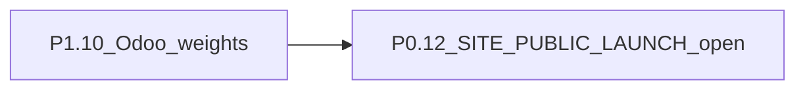

# Jhonny Surf Store — Website Launch Status

**Audience:** owner + shop/ops + technical team  
**Last updated:** 29 August 2026  
**Live sites:** [jhonnysurfstore.com](https://www.jhonnysurfstore.com) · [jhonnysurfstore.pt](https://www.jhonnysurfstore.pt)  
**HTML version:** [website-launch-status.html](./website-launch-status.html)  
**PDF version:** [website-launch-status.pdf](./website-launch-status.pdf) *(may lag this markdown)*

---

## 1. Purpose

This document states whether the website is ready for **public online purchases**, what already works, and the **ordered backlog** to go live on both domains.

---

## 2. Executive verdict

**The shop is public.** Coming-soon and preview-password unlock are retired. Crawlers get `Allow: /` plus a sitemap unless `SITE_COMING_SOON=true` (emergency lock only).

Checkout, payments, fatura-recibo, shipping totals, coupons, email, My orders, FAQ, and the security baseline are on `main`. Remaining ops work (Odoo weights, P1.10) does not keep the storefront hidden.

| Area | Status |
|------|--------|
| Brand / homepage content | Ready (recent store photos on homepage + shop heroes — P1.8) |
| Product catalog (Odoo → site) | Connected; cron + stale-kick sync (P0.18) |
| Browse shop, filters, product pages | Ready |
| Cart + checkout | Ready for preview; totals include coupon + Portes |
| Payments (MB WAY, Multibanco, Stripe card / PayPal / Klarna) | **Code live** — P1.7 payment smoke done (ops) |
| Security / abuse protection | **Baseline done** (P0.4, P0.14–P0.17) |
| Order email + ops admin | Emails + fatura PDF send; admin orders/analytics exist |
| Public go-live (.com + .pt) | **Live** — no preview password |

### What to tackle next

1. **Ops in Odoo:** fill **Weight** (and L/W/H on boards). Most SKUs are still `0`, so portes use category guesses (0.8 kg default) — **P1.10**.
2. Emergency hide only: `SITE_COMING_SOON=true` (also sets `Disallow: /`).

---

## 3. What works today

- Homepage and store story (New In, categories, services, Local Heroes, visit/contact).
- Shop at `/loja` with catalog from Odoo/Postgres; product detail, variants, ratings, cart drawer.
- Guest and registered carts; stock checked at add/checkout; paid orders decrement Odoo + website qty.
- Account: register (year-first birthday), login, Google, **password reset**, **email confirmation before the account exists**, profile, **My orders**.
- Coupons: athlete codes + **JHONNY10** (signed-in, first paid order only); usage written **only after pay**.
- Checkout sidebar = payment amount: Subtotal, Cupão −X%, Portes (CTT bands / €100 free / pickup €0), Total.
- Paid path: Ifthenpay MB WAY/Multibanco + Stripe Checkout (card, Google Pay, PayPal, Klarna, Revolut, Pix).
- Official Odoo POS fatura-recibo (coupon % + Portes line) emailed to customer and Jhonny.
- Admin: orders, customers, analytics (pageviews, coupon uses, GPS vs IP).
- Legal pages PT/EN; free shipping **€100** on banner, checkout, and payments page.
- Public shop on .com and .pt. `/preview-access` and `/coming-soon` redirect home.
- Security baseline: fail-closed payments, callback secret + amount checks, rate limits, locked sync APIs, security headers, no default `SESSION_SECRET`.

---

## 4. Target launch decisions

| Decision | Choice |
|----------|--------|
| Domains | **.com and .pt** serve the full shop |
| Day-1 payments | **MB WAY + Multibanco + PayPal + Klarna** (PayPal/Klarna via Stripe) |
| Free shipping | **€100** after coupon on merchandise; pickup always €0 |
| Languages at launch | PT / EN / ZH for most UX; legal ZH can follow |
| Brand imagery | Homepage + category heroes use **recent real photos** |
| Odoo ↔ website | Catalog stays in **near real-time** sync |
| Security bar | Fail closed on payments/secrets; authenticated admin/sync; rate limits; headers |

---

## 5. Current gaps (snapshot)

| Integration | Production status |
|-------------|-------------------|
| Odoo | Configured. Incremental cron ~every 2 min + hourly full sync. Weights/dims often empty. |
| Email (SMTP) | **Done** — order, payment, welcome, password-reset, fatura PDF |
| Ifthenpay MB WAY / Multibanco | **Wired and fail-closed** — live paid orders have already issued faturas |
| Stripe (card / PayPal / Klarna / …) | **Wired** — P1.7 payment smoke done (ops) |

Other remaining gaps:

- Most products have **Odoo weight = 0**, so shipping uses category fallbacks (see P1.10).
- Homepage / category heroes use the recent store photos (P1.8 done).
- Public domains stay locked until **P0.12**.
- Unpaid pending orders are **not** reserved (stock drops only when paid).

### 5.1 Security posture

**Done (P0)**

- Ifthenpay callback: secret required in prod, constant-time compare, amount/status checks.
- Missing payment keys fail closed (no mock paid refs in production).
- Mock catalog blocked in production unless `ALLOW_MOCK_CATALOG=true`.
- Odoo sync requires `CRON_SECRET` / ops bearer.
- Rate limits on auth, checkout, coupon, callback.
- Production refuses missing/default/weak `SESSION_SECRET`.
- Security headers in `next.config.ts`.
- Password reset tokens hashed, 1h, single use (P1.3).
- Order email fields HTML-escaped.

**Done this pack (P1)**

- Email/password signup must click the confirm link before the account exists; then they fill the profile on `/conta`. Google skips this. Guest checkout still works. — P1.11.
- Rate limits on public ratings and availability-notify — P1.9.

**Still open (P1 ops)**

| Risk | Why it matters |
|------|----------------|
| Odoo weights still empty on most SKUs | Portes fall back to category guesses |

---

## 6. Priority backlog

**Description** is the plain-language meaning of each ID (what it is, where it shows up, why it exists). Effort is **rough sizing** (not a calendar). S ≈ hours · M ≈ 1–2 days · L ≈ several days.

### P0 — Must ship before public purchases

| # | Item | Description | Status | Effort |
|---|------|-------------|--------|--------|
| P0.1 | Ifthenpay MB WAY + Multibanco | Portuguese bank payments: customer pays with MB WAY or a Multibanco entity/reference. The bank callback must prove the amount before we mark the order paid. | **Done** (code + live paid path) | — |
| P0.2 | PayPal via Stripe Checkout | Customer can pay with PayPal on the Stripe-hosted checkout page (not a separate PayPal account integration). | **Done** (proved in P1.7) | — |
| P0.3 | Klarna via Stripe Checkout | Customer can pay later / in instalments with Klarna, also via Stripe Checkout. | **Done** (proved in P1.7) | — |
| P0.4 | Harden payment callback | The Ifthenpay “paid” webhook is secret-only, compares amounts, and ignores fake or wrong-status notices. | **Done** | — |
| P0.5 | Post-checkout UX + email | After checkout the customer sees (and is emailed) what to do next: Multibanco entity/ref, MB WAY waiting, or the Stripe pay link. | **Done** | — |
| P0.6 | Transactional email | SMTP sends welcome, order, payment, password-reset, verify, and fatura emails to the customer and Jhonny. | **Done** | — |
| P0.7 | Decrement stock on paid order | When an order is paid, website + Odoo stock go down. Unpaid carts do **not** reserve stock. | **Done** (unpaid still not reserved) | — |
| P0.8 | Coupon usage only after payment | A coupon (JHONNY10, athlete codes) is only consumed when the order is paid, so abandoned checkouts do not burn the code. | **Done** | — |
| P0.9 | Full shipping address when ship-to-home | Delivery checkout requires street, postal code, city, and country. Pickup does not. | **Done** | — |
| P0.10 | €100 free shipping | Merchandise orders at or above €100 (after coupon) get €0 portes. Pickup is always free. Shown on banner, checkout, and legal pages. | **Done** | — |
| P0.11 | Shipping cost in checkout Total | Checkout Total = products − coupon + CTT portes (or €0 pickup / free-over-€100). Same portes line goes on the Odoo fatura. | **Done** | — |
| P0.12 | Open public domains | Flip Vercel `SITE_PUBLIC_LAUNCH=open` so .com and .pt stop showing coming-soon. `true` is ignored on purpose. Also turns on public robots/sitemap. | **Ready to flip** after P1.10 | S |
| P0.13 | Block mock catalog | Production cannot sell the 3 built-in demo products unless you explicitly allow it. | **Done** | — |
| P0.14 | Refuse weak session secret | The live site will not start checkout/login if `SESSION_SECRET` is missing or still the default. | **Done** | — |
| P0.15 | Rate-limit auth / checkout / coupon / callback | Too many login, register, checkout, coupon, or payment-callback hits from one IP get HTTP 429. | **Done** | — |
| P0.16 | Lock Odoo sync + status APIs | Catalog sync and ops status URLs need `CRON_SECRET` / admin — they are not public. | **Done** | — |
| P0.17 | Security HTTP headers | Browser headers (no iframe embed, HSTS, nosniff, baseline CSP) reduce common web attacks. | **Done** | — |
| P0.18 | Near real-time catalog sync | Odoo products, price, and stock refresh on the site about every 2 minutes (plus a catch-up if a page looks stale). | **Done** | — |

**P0 left:** only **P0.12** (flip the launch flag). Do that after you are happy with portes (P1.10).

### P1 — Launch ops and trust (active)

| # | Item | Description | Status | Effort |
|---|------|-------------|--------|--------|
| P1.1 | Admin orders | Staff page `/admin/encomendas`: list orders and mark pickup / shipped / preparing. | **Done** | — |
| P1.2 | Customer **My orders** | Signed-in `/conta#encomendas` shows that customer’s orders: items, coupon, portes, total, and Multibanco entity/ref if still unpaid. | **Done** | — |
| P1.3 | Password reset | “Forgot password” emails a 1-hour, single-use link. Google-only accounts stay on Google sign-in. | **Done** | — |
| P1.4 | JHONNY10 first-purchase coupon | Signed-in customers get 10% on their **first paid** order only. The code does not stick if they never pay. | **Done** | — |
| P1.5 | FAQ / trust copy | FAQ “Já posso comprar online?” must say the shop is live (MB WAY, Multibanco, card, PayPal, Klarna) — not “em preparação”. Also covers fatura, reset, JHONNY10. | **Done** | — |
| P1.6 | Scripted paid-path tests | Owner completed live paid-path checks on every payment method (same bar as P1.7). Offline scripts remain; no extra CI live-pay job. | **Done** (ops) | — |
| P1.7 | One live order per payment method | You already placed a real/sandbox paid order on Multibanco, MB WAY, and Stripe (card or PayPal/Klarna) and checked the fatura matches checkout. | **Done** (ops) | — |
| P1.8 | Recent homepage + category photos | Swap older hero / category pictures for new real store photos. You drop files in `website/public/brand/` when you have them. | **Done** (#154) | — |
| P1.9 | Email HTML escape + spam limits | Order emails cannot inject HTML from names/addresses. Product ratings and “notify when available” are rate-limited. | **Done** | — |
| P1.10 | Fill Odoo **weight + size** | In Odoo, put real kg (and board length/width/height) on products. The site uses that for CTT portes. Empty weight = a category guess (often 0.8 kg). | **Open — next ops** | S (ops) |
| P1.11 | Email verification | Email/password signup stays pending until they click the 24h link. Then they are signed in and sent to `/conta` to fill the profile. Login is blocked until confirmed. Google-verified emails skip this. Guest checkout still works. | **Done** | — |

### P2 — Soon after go-live

| # | Item | Description | Status | Effort |
|---|------|-------------|--------|--------|
| P2.1 | Leftover Portuguese-only UI strings | Some shop / product / checkout labels are still hardcoded in PT when the customer picked EN or ZH. | **Done** — site-owned chrome only; Odoo titles stay as stored | — |
| P2.2 | Real cart drawer | Side cart that opens from the bag icon (qty, remove, go to cart/checkout) instead of only a full cart page. | **Done** | — |
| P2.3 | Empty Odoo categories | Hide (or fill in Odoo) categories that show 0 products, e.g. an empty women’s wetsuits group. | **Done** — keep as-is by design | — |
| P2.4 | Product image gallery | Product pages should show several photos you can click through, not only one thumbnail. Some products already have extra images. | **Done** | — |
| P2.5 | Bulky board shipping | Oversized boards that exceed CTT limits get a €29.90 quote plus a note that Jhonny will confirm. | **Done** | — |
| P2.6 | Size / color variant UX | When Odoo has the same board in several sizes or colors, the product page should pick the variant cleanly. Basic support is live; polish can continue. | **Done** — Color/Size axes merged; gallery follows the selected variant | — |
| P2.7 | Zero leftover negative Odoo stock | Clean leftover negative on-hand quantities in Odoo (script in draft `#138`). Dry-run first — do not apply blindly. | **Done** — live apply to 0; shoppers see in/out of stock only | — |

### P3 — Later / growth

| # | Item | Description | Status | Effort |
|---|------|-------------|--------|--------|
| P3.1 | Chinese legal pages | Terms, privacy, returns, and payments pages fully translated to ZH (shop UI already has ZH). | **Done** — ZH from Portuguese on the six InfoPages | — |
| P3.2 | SEO | Public sitemap, robots.txt, and product share cards (title/image when you paste a link). | **Done** — wired to `SITE_PUBLIC_LAUNCH=open`; coming-soon stays noindex | — |
| P3.3 | First-party analytics | Cookie-consent pageviews, coupon uses, and admin dashboards. Google Analytics is optional later. | **Done** | — |
| P3.4 | Ratings on product cards | Star scores on `/loja` tiles, not only on the product detail page. | **Done** | — |
| P3.5 | Abandoned-cart emails | Reminder email if someone leaves products in the cart and does not pay. | **Done** — registered + marketing consent only; hourly cron + dedup | — |

---

## 7. Suggested go-live sequence (now)

1. **P1.10** — put real kg (and board cm) on Odoo products; wait for sync.  
2. **P0.12** — `SITE_PUBLIC_LAUNCH=open` on Vercel (also enables robots/sitemap).  
3. Announce.

---

## 8. Definition of “live for purchases”

- [x] Customers can start MB WAY, Multibanco, and Stripe (PayPal/Klarna/card) checkouts (no mocks in prod).  
- [x] **P1.7:** one successful paid order per method, fatura matches checkout.  
- [x] After checkout they get payment instructions (page + email).  
- [x] Paid orders update via secure callback.  
- [x] Stock decrements on pay; coupons stick only on paid orders.  
- [x] Free shipping threshold is **€100** in banner, checkout, and legal.  
- [x] Order + fatura emails send.  
- [x] Staff can see and update orders (`/admin/encomendas`).  
- [x] Customer can see **My orders**.  
- [ ] **jhonnysurfstore.com** and **.pt** both serve the full shop (`SITE_PUBLIC_LAUNCH=open`).  
- [x] Auth/checkout/callback rate-limited; Odoo sync not anonymous.  
- [x] Production refuses weak `SESSION_SECRET`; security headers on.  
- [x] Catalog sync on a short cron.  
- [x] Homepage + category heroes use **approved recent photos**.  

Until P0.12 is green, treat the public internet as **coming-soon**, not an open webshop.

### Performance / security pass (29 Aug 2026)

Local curl (tiny seed catalog, warm Next 16):

| Page | Before TTFB | After TTFB | Notes |
|------|-------------|------------|--------|
| `/` | 0.08–0.10s warm (0.69s first) | ~0.10s warm | Brand names now `unstable_cache` 60s |
| `/loja` | 0.044s | similar | Client skips a second `/api/products` when SSR already has the full filtered page (< 60) |
| PDP / cart | 0.03–0.09s | similar | Gallery `?i=` bounded; no extra Odoo sync on list |
| `GET /api/products` | 1.1 KB here | same | Production catalog is larger; lean payload unchanged |
| `GET /api/surf` | 0.014s | 0.011s | Dropped `force-dynamic` so the 30 min cache can apply |

Client homepage no longer fires `/api/auth/me`, `/api/cart`, `/api/menu-categories`, and `/api/wheel/status` 2–3 times on first paint (shared 4s cache). Instagram media waits until the strip is near the viewport. Cron `/api/cron/abandoned-cart` stays 401 without `CRON_SECRET`. Coming-soon still `noindex`; `/robots.txt` is reachable and `Disallow: /` until `SITE_PUBLIC_LAUNCH=open`.

---

## 9. Key technical references

| Topic | Location |
|-------|----------|
| Coming-soon + preview unlock | `website/src/proxy.ts`, `website/src/lib/ecommerce/siteAccess.ts`, `/preview-access` |
| Shipping quote (CTT bands, €100, bulky) | `website/src/lib/ecommerce/shipping.ts` |
| Checkout totals | `website/src/lib/ecommerce/checkout.ts`, `CheckoutClient.tsx` |
| Coupon after pay + JHONNY10 | `website/src/lib/ecommerce/coupons.ts` |
| POS fatura coupon + Portes | `website/src/lib/ecommerce/odooPos.ts`, `orderPricing.ts` |
| Payments | `website/src/lib/ecommerce/payments.ts`, `stripeCheckout.ts` |
| Ifthenpay callback | `website/src/app/api/payments/ifthenpay/callback/route.ts` |
| Password reset | `website/src/lib/ecommerce/passwordReset.ts` |
| Email verification | `website/src/lib/ecommerce/emailVerification.ts` |
| Customer My orders | `website/src/app/api/account/orders/route.ts`, `AccountOrders.tsx` |
| Analytics | `website/src/lib/ecommerce/analytics.ts` |
| Odoo catalog + weight sync | `website/src/lib/ecommerce/odooCatalog.ts` |
| Admin orders | `website/src/app/admin/encomendas/page.tsx` |
| Vercel auto-deploy | `website/docs/website-vercel-deploy.md` |

---

*Working backlog for launch. Update this file as P1 items close.*
